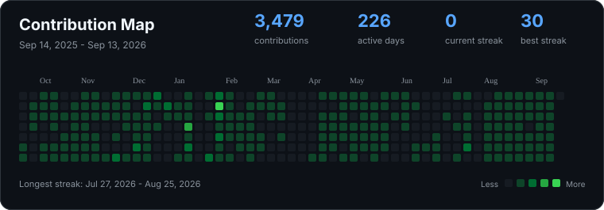
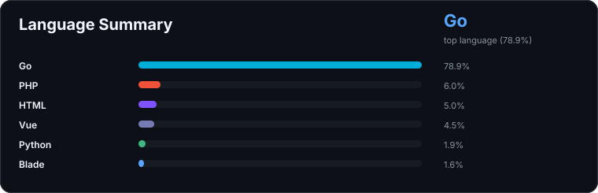

<div align="center">

<a href="https://git.io/typing-svg">
  
</a>

<p>
  <strong>Backend developer focused on API development, database design, and reliable service architecture.</strong>
</p>

<p>
  I enjoy turning product ideas into working systems through backend engineering,
  hackathon builds, and practical software experiments.
</p>

<a href="https://www.linkedin.com/in/azmi-al-ghifari-rahman-442b22289/">
  
</a>
<a href="mailto:azmiagr@gmail.com">
  
</a>
<a href="https://github.com/azmiagr">
  
</a>

<br/>
<br/>


</div>

---

## 👨‍💻 Profile Snapshot

```go
type BackendDeveloper struct {
	Name      string
	Focus     []string
	Currently []string
	Stack     []string
}

azmi := BackendDeveloper{
	Name: "Azmi Al Ghifari Rahman",
	Focus: []string{
		"Backend engineering",
		"REST API design",
		"Database architecture",
		"Reliable service patterns",
	},
	Currently: []string{
		"Building hackathon-driven products",
		"Exploring microservices and distributed systems",
		"Improving backend foundations with Go and Laravel",
	},
	Stack: []string{"Go", "Gin", "Laravel", "MariaDB", "PostgreSQL", "Docker"},
}
```

- 🔭 Building backend systems and hackathon prototypes
- 🌱 Exploring microservices, distributed systems, and blockchain integration
- 🧠 Interested in API design, database architecture, and offline-first systems
- 💬 Open to conversations about Golang, Gin, Laravel, REST APIs, and relational databases

---

<h2 align="center">🛠️ Tech Stack</h2>

<h3 align="center">Languages</h3>

<div align="center">


</div>

<h3 align="center">Backend</h3>

<div align="center">


</div>

<h3 align="center">Databases</h3>

<div align="center">


</div>

<h3 align="center">Tools & Infrastructure</h3>

<div align="center">


</div>

---

<h2 align="center">📊 GitHub Analytics</h2>

<div align="center">



<br/>
<br/>



</div>

---

<h2 align="center">🤝 Let's Connect</h2>

<div align="center">

<p>
  I'm open to discussing backend systems, API architecture, hackathon ideas,
  and practical software engineering work.
</p>

<a href="https://www.linkedin.com/in/azmi-al-ghifari-rahman-442b22289/">
  
</a>
<a href="mailto:azmiagr@gmail.com">
  
</a>

<br/>
<br/>

> "First, solve the problem. Then, write the code."

<br/>

⭐ From [Azmi Al Ghifari Rahman](https://github.com/azmiagr)

</div>
